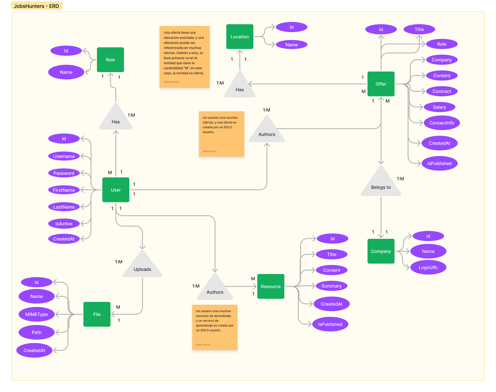

# Database design

This document explains the database design for JobsHunters.

## Entity-Relationship Diagram



## Relational Model Diagram

```txt
roles(<fk:role_id>, name)

users(<pk:user_id>, username, password, first_name, last_name, created_at, is_active, <fk:role_id>)

locations(<fk:location_id>, name)

companies(<fk:company_id>, name)

offers(<pk:offer_id>, title, role, content, contract, salary, contact_info, created_at, is_published, <fk:user_id>, <fk:company_id>)

resources(<pk:resource_id>, title, summary, content, created_at, is_published, <fk:user_id>)
```
